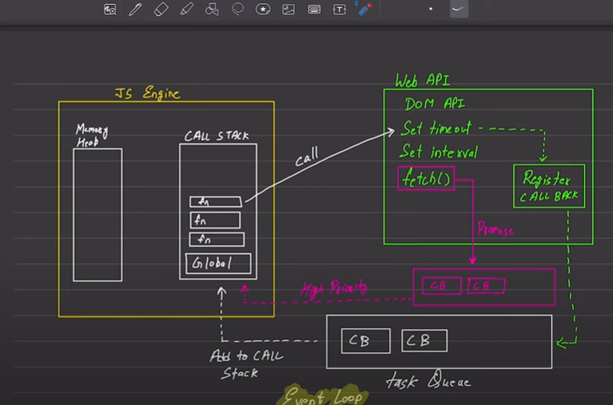

## 1. Parsing & Compilation

When a `<script>` is loaded (or a module is imported), the engine performs two main steps:

1. **Parsing**

   - Converts source code into an Abstract Syntax Tree (AST).

2. **Compilation/Bytecode Generation**

   - Traverses the AST to produce optimized bytecode or machine code (depending on engine).

> **Key point:** JavaScript engines (V8, SpiderMonkey) use _Just-In-Time_ (JIT) compilation—hot code paths get optimized on the fly.

---

## 2. Creation of the Global Execution Context

Before any code runs, an initial execution context is created for the global scope. It sets up:

- **Memory Heap** – where objects and data live.
- **Call Stack** – which tracks active function calls.
- **Variable Environment** – maps identifiers to values.

---

## 3. Execution Context Lifecycle

Each time a function is invoked, a new _Function Execution Context_ is pushed onto the call stack, with two phases:

1. **Creation Phase**

   - **Hoisting**:

     - All `var` declarations are set to `undefined`.
     - Function declarations are bound to their function object.

   - **Scope Chain**:

     - Links to the outer (parent) context for identifier lookup.

2. **Execution Phase**

   - Code runs line-by-line, assigning values to variables and executing statements.

```js
function foo() {
  console.log(a); // 1) Creation: var a -> undefined
  var a = 2; // 2) Execution: a = 2
  console.log(a); // 3) prints 2
}
foo();
```

---

## 4. The Call Stack

Synchronous calls are handled via the call stack:

```js
function a() {
  b();
  console.log("a done");
}
function b() {
  c();
  console.log("b done");
}
function c() {
  console.log("c done");
}

a();
// Call stack evolves:
// [global] → push a → push b → push c → pop c → pop b → pop a
```

- Each `push` is a new execution context; each `pop` returns to the caller.

---

## 5. Asynchronous Tasks & The Event Loop

JavaScript in browsers (and Node.js) is single-threaded but non-blocking via an _event loop_:

1. **Call Stack** – executes code.

2. **Web APIs / Node APIs** – handle timers, I/O, DOM events, HTTP requests, etc.

3. **Callback Queues**

   - **Macro-task queue** (e.g., `setTimeout`, I/O callbacks).
   - **Micro-task queue** (e.g., `Promise.then`, `MutationObserver`).

4. **Event Loop**

   - If the call stack is empty, pick the next task from the _micro-task queue_ (drain it fully), then one _macro-task_, and so on.

```js
console.log("start");

setTimeout(() => {
  console.log("timeout");
}, 0);

Promise.resolve().then(() => console.log("promise"));

console.log("end");

// Output order:
// 1. start           (sync)
// 2. end             (sync)
// 3. promise         (micro-task)
// 4. timeout         (macro-task)
```

---

## 6. Micro-tasks vs Macro-tasks

- **Micro-tasks** run _immediately after_ the current execution context finishes, before rendering and before any macro-tasks.
- **Macro-tasks** run one at a time between render ticks.

| Task Type  | Examples                                             |
| ---------- | ---------------------------------------------------- |
| Macro-task | `setTimeout`, `setInterval`, I/O callbacks           |
| Micro-task | `Promise.then`, `queueMicrotask`, `MutationObserver` |

---

## 7. Example: Combining Sync & Async

```js
console.log("script start");

function timerTask() {
  console.log("timer Task");
}

setTimeout(timerTask, 0);

Promise.resolve()
  .then(() => {
    console.log("promise1");
    return Promise.resolve("promise2");
  })
  .then((msg) => console.log(msg));

console.log("script end");
```

**Execution breakdown**

1. **script start** (sync)
2. **script end** (sync)
3. **promise1** (micro-task #1)
4. **promise2** (micro-task #2)
5. **timer Task** (macro-task)

---

## 8. Behind the Scenes: Optimization & Deoptimization

Modern engines monitor “hot” functions and:

- **Optimize** them by generating highly efficient machine code.
- If assumptions are invalidated (e.g., object shapes change), they **deoptimize** back to baseline code.

---

### Summary

1. **Parse & compile** your JS into AST and bytecode.
2. **Create** the global execution context (heap, stack, scope).
3. **Hoist** declarations, then **execute** line by line in the call stack.
4. **Push/pop** function contexts synchronously.
5. **Handle async** via the event loop, using Web/Node APIs, macro-task and micro-task queues.
6. **Optimize** hot paths and deoptimize when necessary.

Understanding these layers—execution contexts, the call stack, the event loop, and task queues—lets you predict and control both synchronous and asynchronous behavior in your applications.

## Refer the Image below for clarification


